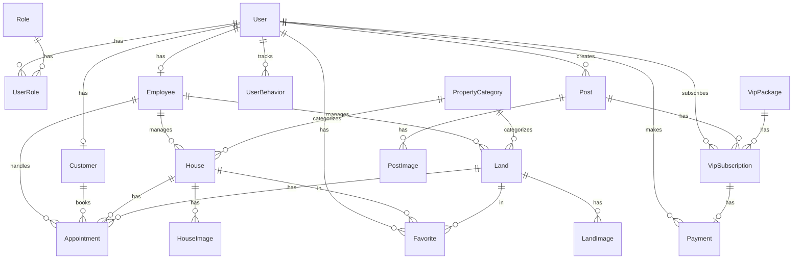

# 📋 Định nghĩa Trang & Nghiệp vụ — Real Estate Platform

> Tài liệu mô tả đầy đủ các trang FE và nghiệp vụ chức năng, ánh xạ tới Backend API (NestJS) + AI Valuation (Python/FastAPI).

---

## 🔐 A. TRANG XÁC THỰC (Auth)

### 1. Đăng nhập (`/login` → LoginPage)
- Đăng nhập bằng username/password (JWT access + refresh token)
- Đăng nhập bằng Google OAuth 2.0
- Redirect theo role: ADMIN → `/admin`, EMPLOYEE → `/employee`, CUSTOMER → `/`
- **BE**: `POST /api/auth/login`, `POST /api/auth/google`

### 2. Đăng ký (`/register` → RegisterPage)
- Form: username, email, phone, password, fullName
- Gửi OTP xác thực email qua RabbitMQ → mail_queue
- Tự động tạo Customer profile sau khi xác thực
- **BE**: `POST /api/auth/register`

### 3. Xác thực OTP (`/otp` → ConfirmOTP)
- Nhập mã OTP 6 số gửi qua email
- Hỗ trợ cả luồng đăng ký và quên mật khẩu
- **BE**: `POST /api/auth/verify-otp`

### 4. Quên mật khẩu (`/forgot-password` → ForgotPasswordPage)
- Nhập email → gửi OTP → xác thực → đặt mật khẩu mới
- **BE**: `POST /api/auth/forgot-password`, `POST /api/auth/reset-password`

### 5. Hồ sơ cá nhân (`/profile` → ProfilePage)
- Xem/sửa thông tin: fullName, phone, email, address
- Hiển thị trạng thái VIP và ngày hết hạn
- Đổi mật khẩu
- **BE**: `GET/PUT /api/profile`, `PUT /api/profile/change-password`

---

## 🏠 B. TRANG CÔNG KHAI (Public)

### 1. Trang chủ (`/` → HomePage)
| Section | Mô tả |
|---------|-------|
| Banner Slider | 3 slide tự động xoay mỗi 4s với overlay gradient |
| AI Recommendations | Gợi ý BĐS cá nhân hoá bằng Hybrid AI (chỉ hiện khi đã đăng nhập), hiển thị % phù hợp dạng ring chart |
| Danh mục nhanh | 3 card: Mua bán nhà, Mua bán đất, Bài viết — navigate tới trang tương ứng |
| BĐS theo khu vực | Grid ảnh 5 thành phố lớn (HCM, HN, ĐN, CT, BD) |
| Nhà nổi bật | Grid 4 PropertyCard — lấy từ Featured API |
| Đất nổi bật | Grid 4 PropertyCard — lấy từ Featured API |
| Bài viết VIP nổi bật | Grid 4 bài VIP có border gradient vàng cam |
| Thông tin hữu ích | 4 card: BĐS bán, BĐS thuê, Đánh giá dự án, Wiki BĐS |

- **BE**: `GET /api/featured`, `GET /api/featured/posts`, `GET /api/recommendation/ai`
- **Behavior tracking**: Ghi nhận click recommendation → `POST /api/recommendation/behavior`

### 2. Danh sách Nhà (`/houses` → HouseListPage)
- Danh sách nhà dạng grid, hỗ trợ filter (city, district, price range, area, direction, bedrooms)
- Phân trang, sắp xếp theo giá/ngày đăng
- Bài VIP hiển thị ưu tiên lên đầu
- **BE**: `GET /api/houses`

### 3. Chi tiết Nhà (`/houses/:id` → HouseDetailPage)
- Gallery ảnh kiểu Airbnb (1 lớn + 4 nhỏ) + Lightbox fullscreen
- Bảng thông tin: giá, diện tích, phòng ngủ/tắm, tầng, hướng, mã, danh mục, trạng thái
- Mô tả chi tiết
- Sidebar: giá, nút Yêu thích (toggle), nút Đặt lịch hẹn
- Bản đồ Google Maps embed theo địa chỉ
- Ẩn nút đặt lịch nếu nhà đã bán (status = SOLD)
- **BE**: `GET /api/houses/:id`, `POST /api/favorites`, `POST /api/recommendation/behavior`

### 4. Danh sách Đất (`/lands` → LandListPage)
- Tương tự HouseListPage nhưng cho đất
- Filter thêm: landType, legalStatus, frontWidth
- **BE**: `GET /api/lands`

### 5. Chi tiết Đất (`/lands/:id` → LandDetailPage)
- Tương tự HouseDetailPage
- Thông tin riêng: mặt tiền, chiều dài, loại đất, pháp lý
- **BE**: `GET /api/lands/:id`

### 6. Đặt lịch hẹn (`/appointment` → AppointmentBookingPage)
- **Yêu cầu**: đăng nhập + role CUSTOMER
- Nhận `houseId` hoặc `landId` qua query param
- Hiển thị card BĐS bên trái (ảnh, giá, diện tích)
- Form: chọn ngày, giờ, thời lượng (30/60/90 phút), ghi chú
- Sau submit → hệ thống tự động phân công nhân viên qua RabbitMQ (`appointment_auto_assign_queue`)
- **BE**: `POST /api/appointments`

### 7. Bài viết / Tin tức (`/posts` → NewsPage)
- Hero slider 5 bài VIP/mới nhất
- Search bar + filter loại bài (NEWS, SELL_HOUSE, RENT_HOUSE, SELL_LAND, RENT_LAND, NEED_BUY, NEED_RENT, PROMOTION) + sort (mới nhất, cũ nhất, phổ biến)
- Danh sách dạng list card (VIP card có gradient cam nổi bật)
- Sidebar phải: Bài viết nổi bật (ranked) + Bài viết mới nhất (thumbnail stack)
- Phân trang đầy đủ với jump-to-page
- **BE**: `GET /api/posts/approved`

### 8. Chi tiết bài viết (`/posts/:id` → NewsDetailPage)
- Nội dung HTML (CKEditor 5 rendered)
- Ảnh bài viết, thông tin người đăng, ngày đăng
- Thông tin BĐS liên quan (nếu postType = SELL/RENT)

### 9. Tạo/Sửa bài viết (`/posts/new`, `/posts/:id/edit` → PostFormPage)
- **Yêu cầu**: đăng nhập
- Form: loại bài, tiêu đề, mô tả (CKEditor), giá, diện tích, hướng, địa chỉ (city/district/ward)
- Upload nhiều ảnh (Cloudinary)
- Fields dynamic theo loại bài: nhà (bedrooms, bathrooms, floors), đất (frontWidth, landLength, landType, legalStatus), nhu cầu (minPrice, maxPrice, minArea, maxArea)
- Bài đăng mới có status = 1 (chờ duyệt)
- **BE**: `POST /api/posts`, `PUT /api/posts/:id`

### 10. Bài viết của tôi (`/my-posts` → MyPostsPage)
- **Yêu cầu**: đăng nhập
- Danh sách tất cả bài đăng của user hiện tại
- Filter: search, status (chờ duyệt/đã duyệt/từ chối), loại bài, VIP only
- Mỗi bài: xem trước (PreviewDrawer side panel), sửa, xoá, nâng VIP
- VIP Banner: hiển thị trạng thái VIP tài khoản
- Modal nâng VIP bài: chọn nâng từng bài hoặc nâng tài khoản
- **BE**: `GET /api/posts/my-posts`, `DELETE /api/posts/:id`

### 11. Yêu thích (`/favorites` → FavoritesPage)
- **Yêu cầu**: đăng nhập
- Danh sách BĐS (nhà + đất) đã yêu thích
- Bỏ yêu thích trực tiếp từ danh sách
- **BE**: `GET /api/favorites`, `DELETE /api/favorites/:id`

### 12. Nâng cấp VIP (`/vip-upgrade` → VIPUpgradePage)
- **Yêu cầu**: đăng nhập
- 2 mode: **Nâng VIP bài đăng** (POST_VIP) và **Nâng VIP tài khoản** (ACCOUNT_VIP)
- Hiển thị grid các gói VIP (3/7/15/30 ngày) với giá, features, priority level
- Gói phổ biến nhất (priorityLevel=3) có badge "PHỔ BIẾN NHẤT"
- Flow thanh toán: Chọn gói → Modal xác nhận → Chọn VNPay/MoMo → Redirect tới cổng thanh toán
- **BE**: `GET /api/payment/packages`, `POST /api/payment/create`

### 13. Callback thanh toán
| Route | Component | Mô tả |
|-------|-----------|-------|
| `/payment/vnpay-callback` | VNPayCallbackPage | Xử lý callback từ VNPay, verify transaction |
| `/payment/momo-callback` | MoMoCallbackPage | Xử lý callback từ MoMo |
| `/payment/result` | PaymentResultPage | Hiển thị kết quả (thành công/thất bại) |
| `/payment/success` | PaymentSuccessPage | Trang xác nhận thanh toán thành công |

- **BE**: `GET /api/payment/vnpay/callback`, `POST /api/payment/momo/callback`

### 14. Phong thủy (`/fengshui` → FengshuiPage)
- Form: họ tên, ngày sinh (dương/âm lịch), giới tính, địa điểm BĐS
- Kết quả phân tích:
  - **Thông tin cá nhân**: con giáp (emoji), can chi, nạp âm, tam hợp, tứ hành xung, số may mắn
  - **Mệnh Cung**: mệnh (Kim/Mộc/Thủy/Hỏa/Thổ), cung số, ngũ hành sinh/khắc
  - **Bát Trạch**: 4 hướng tốt (Cát) + 4 hướng xấu (Hung) với mô tả chi tiết
  - **VIP only**: Màu sắc hợp mệnh, vật liệu xây dựng, lưu ý chuyên sâu, BĐS gợi ý phù hợp phong thủy
- Non-VIP hiển thị banner "Nâng cấp VIP để xem thêm"
- **BE**: `POST /api/fengshui/analyze`

### 15. Định giá BĐS (`/dinh-gia` → ValuationPage)
- Form: địa chỉ (quận/tỉnh), loại BĐS (căn hộ/nhà riêng/biệt thự/nhà mặt phố/đất), diện tích, phòng ngủ/tắm, tầng, mặt tiền, hướng, pháp lý
- Kết quả AI:
  - **Giá ước tính**: currentValue, pricePerM2, range (min/expected/max)
  - **Radar chart**: đánh giá đa chiều (vị trí, tiện ích, giao thông...)
  - **Area chart**: biến động giá 2024-2025 (min/avg/max)
  - **Tiện ích xung quanh**: trường học, chợ, bệnh viện, công viên + khoảng cách
  - **Phân tích thị trường 2026**: tăng trưởng, thanh khoản, nhận xét AI
  - **BĐS tham khảo**: danh sách BĐS tương đồng (ảnh, giá, diện tích, vị trí)
- Cache kết quả trong sessionStorage
- **BE**: `POST /api/valuation/estimate` → gọi AI Valuation service (Python FastAPI port 8000)

### 16. Giới thiệu (`/about` → AboutMe)
- Trang giới thiệu về nền tảng

---

## 👨‍💼 C. TRANG ADMIN (`/admin/*` — Role: ADMIN)

### 1. Dashboard (`/admin` → DashboardPage)
- **Tổng quan**: 5 stat cards (Nhà, Đất, Người dùng, Lịch hẹn, Bài đăng)
- **7 tab phân tích**:

| Tab | Nội dung |
|-----|----------|
| Tổng quan | Tăng trưởng user (area chart), Phân bổ BĐS (donut), Top khu vực (bar), Pipeline lịch hẹn (4 tiles + completion rate) |
| Người dùng | Biểu đồ tăng trưởng user theo ngày/tháng/năm |
| Bài đăng | Thống kê bài đăng theo loại, trạng thái |
| Doanh thu | Biểu đồ doanh thu từ VIP packages |
| Lịch hẹn | Phân tích lịch hẹn theo trạng thái, thời gian |
| Hành vi | Phân tích hành vi người dùng (view, click, save) |
| Nhân viên | KPI nhân viên, SLA tracking, hiệu suất |

- **BE**: `GET /api/analytics/*`

### 2. Quản lý Nhà (`/admin/houses` → HouseManagementPage)
- Bảng danh sách: code, title, city, price, area, status
- Search, filter theo status/city
- CRUD: Tạo mới / Sửa (`/admin/houses/create`, `/admin/houses/:id/edit` → HouseFormPage)
- Form: title, địa chỉ (city/district/ward/street), giá, diện tích, phòng ngủ/tắm, tầng, hướng, danh mục, nhân viên phụ trách
- Upload nhiều ảnh (Cloudinary), kéo thả sắp xếp vị trí
- **BE**: `GET/POST/PUT/DELETE /api/houses`

### 3. Quản lý Đất (`/admin/lands`)
- Tương tự quản lý nhà, thêm fields: mặt tiền, chiều dài, loại đất, pháp lý
- **BE**: `GET/POST/PUT/DELETE /api/lands`

### 4. Quản lý Bài đăng (`/admin/posts` → PostManagementPage)
- Bảng: title, postType, user, status, isVip, postedAt
- **Nghiệp vụ duyệt bài**: Admin duyệt (status 1→2) hoặc từ chối (status 1→3)
- Filter theo postType, status
- **BE**: `GET /api/posts`, `PUT /api/posts/:id/approve`, `PUT /api/posts/:id/reject`

### 5. Quản lý Lịch hẹn (`/admin/appointments`)
- Bảng: BĐS, khách hàng, nhân viên, ngày hẹn, trạng thái, SLA
- **Trạng thái**: Pending (0) → Approved (1) / Rejected (2)
- **SLA tracking**: slaStatus (0=on_track, 1=at_risk, 2=breached), deadline assign, deadline first contact
- Tạo/sửa appointment (`/admin/appointments/create`, `/admin/appointments/:id/edit`)
- **Lịch**: Xem dạng calendar FullCalendar (`/admin/appointments/calendar`)
- **Auto-assign**: RabbitMQ consumer tự phân công nhân viên theo khu vực + load
- **BE**: `GET/POST/PUT /api/appointments`

### 6. Quản lý Người dùng (`/admin/users` → UserManagementPage)
- Bảng: username, fullName, email, phone, roles, status, isVip
- Khoá/mở khoá tài khoản (soft delete via status)
- Gán role
- **BE**: `GET/PUT/DELETE /api/users`

### 7. Quản lý Khách hàng (`/admin/customers`)
- Bảng: mã KH, user info, ngày tạo, trạng thái
- **BE**: `GET /api/customers`

### 8. Quản lý Nhân viên (`/admin/employees`)
- Bảng: mã NV, user info, khu vực (city/ward), max appointments/day, isActive
- **BE**: `GET/POST/PUT /api/employees`

### 9. Quản lý Role (`/admin/roles` → RoleManagementPage)
- CRUD roles: ADMIN, EMPLOYEE, CUSTOMER
- **BE**: `GET/POST/PUT/DELETE /api/roles`

### 10. Quản lý Danh mục BĐS (`/admin/categories`)
- CRUD property categories (HOUSE/LAND types)
- **BE**: `GET/POST/PUT/DELETE /api/property-categories`

### 11. Quản lý Yêu thích (`/admin/favorites`)
- Xem danh sách favorites toàn hệ thống
- **BE**: `GET /api/favorites/admin`

### 12. Lịch sử thanh toán (`/admin/payment-history`)
- Bảng: user, gói VIP, số tiền, phương thức (VNPay/MoMo), trạng thái, ngày thanh toán
- **BE**: `GET /api/payment/history`

### 13. Quản lý Gói VIP (`/admin/vip-packages`)
- Bảng: tên gói, loại (POST_VIP/ACCOUNT_VIP), giá, thời hạn, priority level, trạng thái
- CRUD gói VIP (`/admin/vip-packages/create`, `/admin/vip-packages/:id/edit`)
- Form: name, description, durationDays, price, packageType, priorityLevel, features (JSON: highlight, topPost, featured, urgent, badge)
- **BE**: `GET/POST/PUT/DELETE /api/vip-packages`

### 14. Hồ sơ Admin (`/admin/profile`)
- Xem/sửa thông tin cá nhân admin

---

## 👷 D. TRANG NHÂN VIÊN (`/employee/*` — Role: EMPLOYEE)

### 1. Dashboard (`/employee` → EmployeeDashboardPage)
- Thống kê nhanh: số lịch hẹn hôm nay, chờ xử lý, hoàn thành

### 2. Quản lý Lịch hẹn (`/employee/appointments`)
- Chỉ hiển thị lịch hẹn được phân công cho nhân viên hiện tại
- Cập nhật trạng thái: duyệt, từ chối, ghi nhận kết quả thực tế (actualStatus)
- **BE**: `GET /api/appointments?employeeId=me`

### 3. Lịch làm việc (`/employee/calendar`)
- FullCalendar hiển thị lịch hẹn theo tuần/tháng

### 4. Quản lý BĐS (`/employee/houses`, `/employee/lands`)
- CRUD nhà/đất mà nhân viên phụ trách (cùng component với admin nhưng filter theo employeeId)

### 5. Quản lý Bài đăng (`/employee/posts`)
- Xem/quản lý bài đăng

### 6. Hồ sơ (`/employee/profile`)
- Xem/sửa thông tin cá nhân

---

## 🤖 E. AI VALUATION SERVICE (Python FastAPI — Port 8000)

### Endpoints
| Method | Path | Mô tả |
|--------|------|-------|
| POST | `/predict` | Dự đoán giá BĐS (input: province, district, propertyType, area, bedrooms, bathrooms, floors, frontWidth, direction, legalStatus) |
| GET | `/health` | Health check |

### Mô hình ML
- 3 models GradientBoosting: `model_low.joblib` (giá sàn), `model_median.joblib` (giá kỳ vọng), `model_high.joblib` (giá trần)
- Training data: 3.5M+ giao dịch thực tế
- Features: province, district, propertyType, area, bedrooms, bathrooms, floors, frontWidth, direction, legalStatus → Label Encoded

---

## 🗄️ F. DATABASE SCHEMA (Prisma/MySQL)

### Status Conventions
| Model | Value | Meaning |
|-------|-------|---------|
| User/House/Land/Employee/Customer | 0=inactive, 1=active | Soft delete |
| Post | 1=pending, 2=approved, 3=rejected | Duyệt bài |
| Appointment | 0=pending, 1=approved, 2=rejected | Duyệt lịch hẹn |
| Appointment.slaStatus | 0=on_track, 1=at_risk, 2=breached | SLA tracking |
| VipSubscription | 0=pending, 1=active, 2=expired, 3=cancelled | Trạng thái VIP |
| Payment | 0=pending, 1=success, 2=failed, 3=cancelled | Thanh toán |

---

## 🔄 G. BACKEND MODULES (NestJS)

| Module | Chức năng chính |
|--------|----------------|
| `auth` | JWT login/register, Google OAuth, refresh token, OTP, reset password |
| `user` | CRUD users, role assignment |
| `customer` | Customer profiles |
| `employee` | Staff management, SLA tracking, auto-assign logic |
| `house` | House CRUD + Cloudinary image upload |
| `land` | Land CRUD + Cloudinary image upload |
| `appointment` | Scheduling, SLA deadlines, auto-assign via RabbitMQ |
| `post` | News/listings CRUD, approval workflow, VIP boost |
| `favorite` | Bookmark houses/lands |
| `payment` | VNPay + MoMo integration, payment lifecycle |
| `vip-package` | VIP package CRUD, subscription management |
| `featured` | Featured properties/posts for homepage |
| `ai` | RAG chatbot (Gemini/Ollama), AI description generation |
| `recommendation` | Hybrid AI property suggestions, user behavior tracking |
| `fengshui` | Feng shui analysis (bát trạch, mệnh cung, ngũ hành) |
| `valuation` | Proxy to AI Valuation service, market analysis |
| `analytics` | Admin KPI dashboards (user growth, revenue, appointments, behavior, employee) |
| `property-category` | Property category management |
| `role` | RBAC roles management |
| `profile` | User profile management |

### Shared Modules
- **CloudinaryModule**: Image upload/management
- **MailModule**: Async email via RabbitMQ → Gmail SMTP
- **RedisModule**: Caching layer (ioredis)
- **PrismaModule**: Database ORM

### RabbitMQ Queues
| Queue | Consumer | Mô tả |
|-------|----------|-------|
| `mail_queue` | MailConsumer | Gửi email bất đồng bộ (OTP, thông báo) |
| `appointment_auto_assign_queue` | AppointmentConsumer | Tự động phân công nhân viên theo khu vực và workload |
